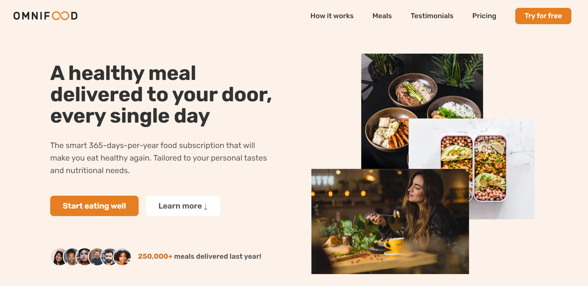

# Omnifood

The project utilizes grid, flexbox and other modern CSS features to create a responsive layout.

## Sections

-   Logo + Navigation
-   Hero
-   Featured in
-   How it works
-   Meals (and list of diets)
-   Testimonials + gallery
-   Pricing + features
-   CTA
-   Footer
